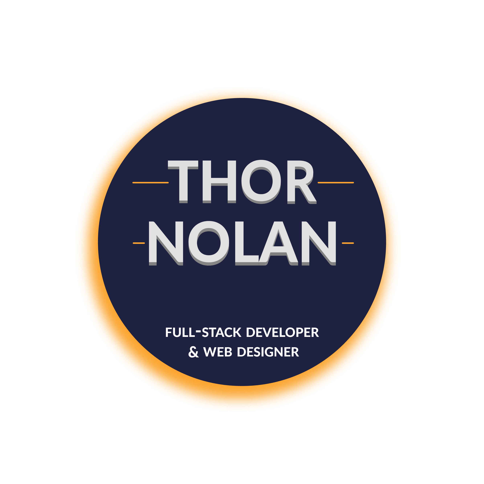

<h1 align="center">
  </a>
</h1>

👋 Welcome to the repository for all the code for my portfolio. It's written in React.JS and uses GatsbyJS to serve up the site as bundled static assets. On the site you'll find info about me and my technical skill-set, as well as links to selected projects and ways to get in touch with me. I work on the it often, so check back for new designs & projects ~

[check it out](https://thornolan.com/ "Deployed website")

## 🔧 Technologies Used

+ [ReactJS](https://reactjs.org/ReactJS/) with [GatsbyJS](https://www.gatsbyjs.com/docs/).

+ **HTML5** and **SCSS** (utilizing many CSS3 features) for page content and styling.

+ A lot of [JavaScript](https://www.javascript.com/).

+ [Particles.js](https://github.com/VincentGarreau/particles.js/) library to create the animated particle background, I customized the look and animation of the particles by adjusting JSON data that can be found in my main JS file and recently translated this into a functional React component!

+ [Parallax.js](https://matthew.wagerfield.com/parallax/) used for my eclipse scene to accomplish the gyroscopic effect based on either device orientation on a tablet or phone or cursor position on a desktop.

+ [React-Icons](https://react-icons.github.io/react-icons/) for icons.

+ [Illustrator](https://www.adobe.com/products/illustrator.html) for custom designs.

## 🌌 Author

Thor Nolan—https://github.com/ThorNolan
